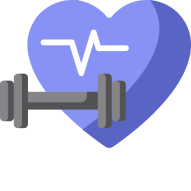
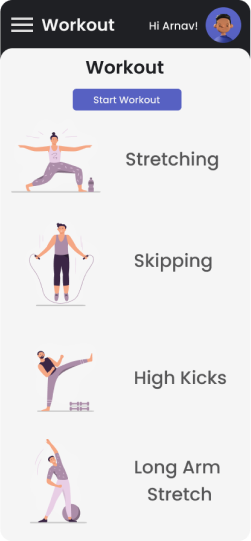
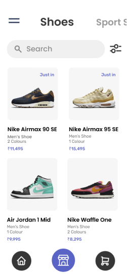
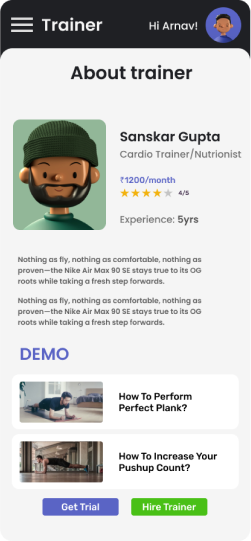

# Hack The Mountain : Mile High
# Fitness Freaks  

 

## Problem Statement 🚧
Improving the quality of life of users and effeciency of medical care by connecting doctors and patients virtually without having them to step out of their homes.

<h3>Login / sign up system</h2>

We will be providing our users the system to sign up and login within the app to maintain and keep a proper track of their progress and goals.

<h2>custom diet chart</h2>

The feature helps the user to input certain factors like their age, sex and height and can customize their diet for the week or a day accordingly. 
There will be notifications for reminding the users to follow up with their diet throughout the day.

<h2>workout plan</h2>

There will be multiple workout plans for the user to choose from and follow it for the upcoming days.

<h2>calorie tracker</h2>

The inputs by the user, for their food consumption will let them know the amount of their calorie intake. This feature helps you be on track with your eating habits.

<h2>fat burns</h2>

If the user follows a workout, then this app will help them keep a track of their fat burn according to their goals.

<h2>health tips</h2>

The app helps as a one-stop solution and brings you the articles and concerned answers for all your queries and doubts regarding anything in terms of your health.

## Background 📖

We’re living in a digital age where technology had a transformative effect on the way we live and work.

## About Our Product 🔧

VaiRoga is combined by using two words Vai derived from Vaidya means “Doctor” and Roga means “Disease”.

It is web app and android app for doctors and patients to communicate with each other conveniently in the face of pandemic.
 
 
 

 
 
 

## Technology Principles Proposed 💡

- User Friendly UI
- Easy Navigation 
- Minimalistic Design
- Open APIs

## Proposed Technology Stack 💻

- Javascript 
- Express
- Node.js
- Reactjs
- Html
- Css
- BootStrap
- Mongoose
- mongodb Atlas
- dotenv
- cors

  

## Tools 

- Heroku
- VsCode
- Mongodb Atlas
- Node 
- Netlify

## Use Cases

1. Reusable code that can be customized for other additional features.
2. Effective in dealing with the current situation.

 

